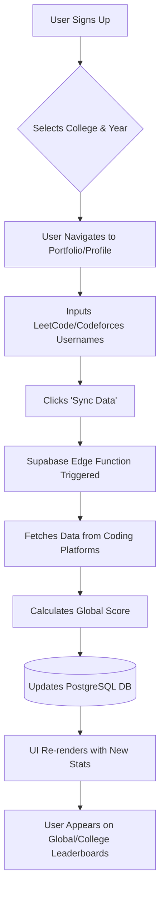

<div align="center">
  
# 🚀 RankMySkills

**The Ultimate Unified Coding Leaderboard for Engineering Students**

[](https://vitejs.dev/)
[](https://reactjs.org/)
[](https://www.typescriptlang.org/)
[](https://tailwindcss.com/)
[](https://supabase.com/)

[**Explore the Leaderboard**](https://rankmyskill.vercel.app/) • [**Report Bug**](#) • [**Request Feature**](#)

</div>

<br/>

## 📖 About The Project

**RankMySkills** is a platform built for engineering students to aggregate and compare their coding achievements across the industry's most popular platforms. Instead of tracking stats across multiple websites, RankMySkills pulls data directly from **LeetCode**, **Codeforces**, **CodeChef**, and **GeeksforGeeks**, synthesizing it into a single, equitable **Global Engineer Score**. 

It provides global, college-level, course-level, and graduation year-specific leaderboards, fostering healthy competition and offering students a clear metric for their technical interview readiness.

### ✨ Key Features

- 🔄 **Real-time Account Sync**: Enter your platform usernames and click sync. We fetch your live stats directly using serverless Edge Functions.
- 🏆 **Unified Global Score**: A custom algorithm normalizes your stats across all platforms into one competitive score.
- 🎓 **College Leaderboards**: Filter the leaderboard to see how you rank among your peers in your specific college, course, and graduation year.
- 🏅 **Dynamic Level Badges**: Advance through ranks from *Novice* to *Grandmaster* as your score increases.
- 🌙 **Modern Premium UI**: Fully responsive, dark-mode prioritized interface built with Shadcn UI and Framer Motion animations.

<br/>

## 🧮 How The Global Score is Calculated

RankMySkills evaluates you on the philosophy that true engineering prowess spans multiple disciplines. An algorithm expert on Codeforces is evaluated on the same playing field as a dynamic programming master on LeetCode.

The overarching formula is weighted as follows:

```javascript
const GlobalScore = (
    (LeetCode.Rating * 0.40)      // 40% Weight
  + (Codeforces.Elo * 0.20)       // 20% Weight
  + (CodeChef.Rating * 0.20)      // 20% Weight
  + (GeeksforGeeks.Score * 0.20)  // 20% Weight
);
```

### Weighting Breakdown:
1. **LeetCode (40%)**: Prioritized heavily as it is the industry standard proxy for technical interviews and data structure fluency.
2. **Codeforces (20%)**: Reflects advanced mathematical logic, problem-solving speed, and performance under contest pressure.
3. **CodeChef (20%)**: Focuses on long challenges and algorithmic thinking in a highly structured, competitive environment.
4. **GeeksforGeeks (20%)**: Rewards long-term consistency and the total volume of solved problems across a wide array of conceptual topics.

<br/>

## 🛠️ Tech Stack

This project is built using modern, fast, and scalable technologies:

**Frontend Ecosystem:**
* **Framework**: React 18 + TypeScript + Vite
* **Styling**: Tailwind CSS + Shadcn UI components
* **Routing**: React Router DOM (v6)
* **Animations**: Framer Motion
* **Icons**: Lucide React

**Backend Ecosystem (BaaS):**
* **Database**: Supabase PostgreSQL
* **Authentication**: Supabase Auth (Email/Password)
* **Compute**: Supabase Edge Functions (Deno) for secure, server-side web scraping and API calls to coding platforms.

<br/>

## 🚀 Getting Started Locally

To get a local copy up and running, follow these simple steps.

### Prerequisites
* [Node.js](https://nodejs.org/) (v18 or higher recommended)
* [npm](https://www.npmjs.com/) (or yarn, pnpm, bun)
* A [Supabase](https://supabase.com/) account for the database

### Installation

1. **Clone the repository**
   ```bash
   git clone https://github.com/Neerajkumar151/RANKMYSKILLS_CODING_PLATFORMS_LEADERBOARD.git
   cd RANKMYSKILLS_CODING_PLATFORMS_LEADERBOARD
   ```

2. **Install NPM packages**
   ```bash
   npm install
   ```

3. **Set up your environment variables**
   Create a `.env` file in the root directory and add your Supabase credentials:
   ```env
   VITE_SUPABASE_URL=your_supabase_project_url
   VITE_SUPABASE_ANON_KEY=your_supabase_anon_key
   ```

4. **Run the development server**
   ```bash
   npm run dev
   ```

5. **Deploy the Database and Edge Functions** (Requires Supabase CLI)
   ```bash
   # Link to your remote project
   supabase link --project-ref your_project_ref
   
   # Push database schema
   supabase db push
   
   # Deploy edge functions for account syncing
   supabase functions deploy sync-data
   supabase functions deploy verify-platform
   ```

<br/>

## 🔄 User Flow Diagram



<br/>

## 👨‍💻 Contributing

Contributions are what make the open source community such an amazing place to learn, inspire, and create. Any contributions you make are **greatly appreciated**.

1. Fork the Project
2. Create your Feature Branch (`git checkout -b feature/AmazingFeature`)
3. Commit your Changes (`git commit -m 'Add some AmazingFeature'`)
4. Push to the Branch (`git push origin feature/AmazingFeature`)
5. Open a Pull Request

<br/>

## 📄 License

Distributed under the MIT License. See `LICENSE` for more information.

<br/>

---
<div align="center">
  Built with ❤️ for Engineering Students
</div>
